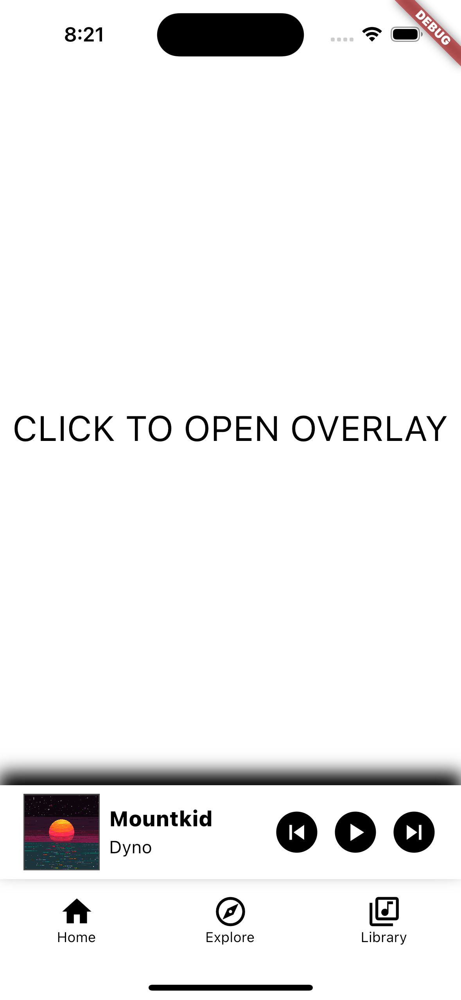
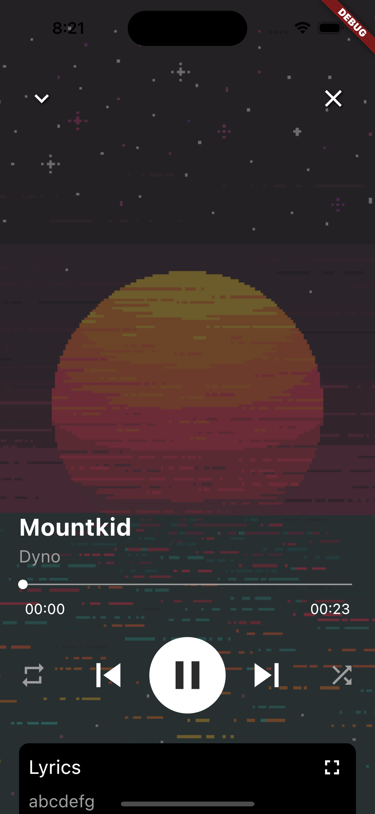
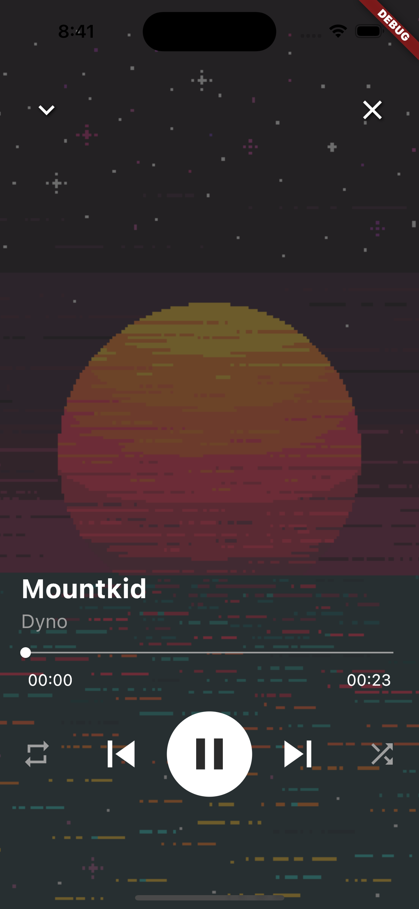
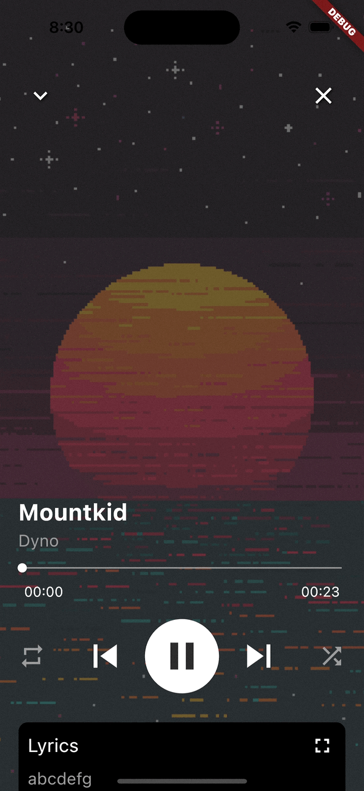

# music_player_design 
 
Basic layout for music player. 
This project only includes UI without streambuilder or anything. 
  
## Details 
 
in small player mode  

   
full screen mode(song with lyrics)  

   
full screen mode(song without lyrics)  

   
shows the album cover when the screen is tapped  

   
default status of lyrics area  

   
lyrics area can be expanded  

